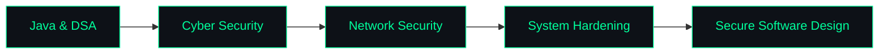

<div align="center">


<br>


</div>

<br>

## 🧑‍💻 About


- 🎓 Computer Science Engineering student
- 🔐 Aspiring **Security Analyst** — into Network & Cloud Security
- 💻 Exploring **Backend Development** & Secure Software Design
- 🌱 Currently training in **Java, DSA, Cyber Security & System Design**
- ⚡ Fun fact: I learn best by breaking things first, fixing them second

<br clear="right"/>

---

## 🧰 Tech Stack

<div align="center">


</div>

<br>

<table width="100%">
<tr>
<td width="50%" valign="top">

**💻 Languages**
```
Java        ████████████████░░░░  80%
JavaScript  ██████████████░░░░░░  70%
HTML / CSS  ████████████████░░░░  80%
```

</td>
<td width="50%" valign="top">

**🔐 Focus Areas**
```
Backend Dev     ███████████████░░░░  75%
Cyber Security  ████████████░░░░░░░  60%
DSA             █████████████░░░░░░  65%
```

</td>
</tr>
</table>

---

## 🚀 Featured Projects

<table width="100%">
<tr>
<td width="50%" valign="top">

### 🎓 Student Profile System
**Full-Stack • Auth-Hardened**

Node.js · Express · MongoDB · Passport.js · Google OAuth · EJS

- 🔐 Google OAuth 2.0 authentication
- 👤 Full CRUD profile management
- 🏗️ Clean MVC architecture
- 🗄️ MongoDB + Mongoose

</td>
<td width="50%" valign="top">

### 🍽️ Casa De Amore
**Responsive Restaurant Website**

HTML · CSS · JavaScript

- 📋 Menu & restaurant info
- 📅 Reservation flow
- 💳 Payment interface
- 📱 Fully responsive UI

</td>
</tr>
</table>

---

## 🧭 Learning Path



---

## 🎖️ Certifications

<div align="center">


</div>

---

## 📊 GitHub Stats

<div align="center">


</div>

---

## 🐍 Contribution Graph

<div align="center">


</div>

> 💡 To activate the snake animation above: add a GitHub Action (`platane/snk`) to your profile repo. I can walk you through the exact workflow file if you want it.

---

<div align="center">


<a href="https://github.com/devbyDiya"></a>
<a href="YOUR_LINKEDIN_URL"></a>
<a href="mailto:YOUR_EMAIL"></a>

<sub>Learning. Building. Securing. 🚀</sub>

</div>
<!--
**devbyDiya/devbyDiya** is a ✨ _special_ ✨ repository because its `README.md` (this file) appears on your GitHub profile.

Here are some ideas to get you started:

- 🔭 I’m currently working on ...
- 🌱 I’m currently learning ...
- 👯 I’m looking to collaborate on ...
- 🤔 I’m looking for help with ...
- 💬 Ask me about ...
- 📫 How to reach me: ...
- 😄 Pronouns: ...
- ⚡ Fun fact: ...
-->
